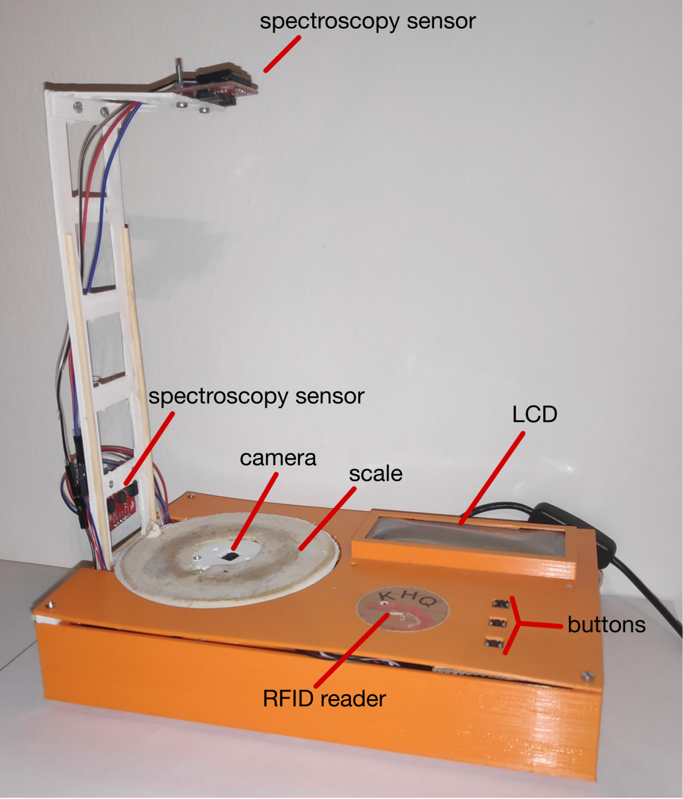
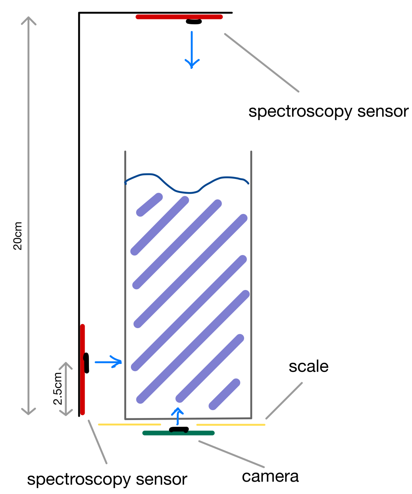
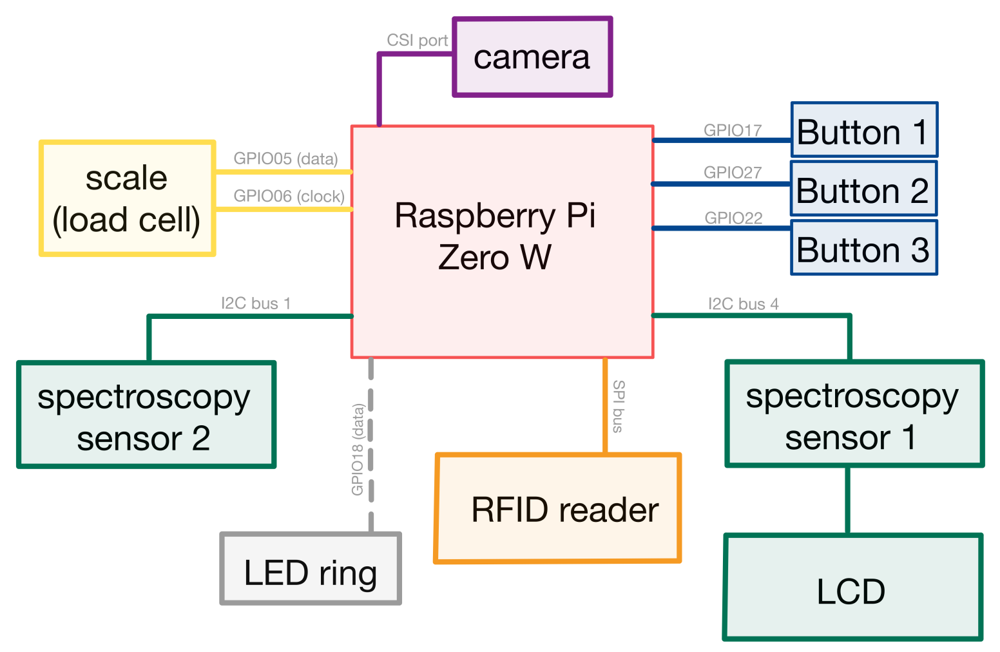

# SmartCoaster

**Authors:** Simon Vasold, Marco Pfleger, Kai Czerwinka

**Timeline:** completed 2023; published 2025

A Raspberry Pi-based coaster that identifies drinks by combining weight (HX711), spectroscopy (two AS7262 sensors), camera imagery, an RFID login (MFRC522), and UI feedback via an I2C LCD, WS2812 ring, and three GPIO buttons. Measurements can be saved for training or classified on-device with an SVM/LDA pipeline; results are pushed to Firestore.

  

## Hardware quick list
- Raspberry Pi with GPIO, I2C, SPI enabled and PiCamera attached
- AS7262 spectroscopy boards on bus1 and bus4; WS2812/NeoPixel 24 LED ring on GPIO 18
- HX711 load cell amplifier on pins 29/31; MFRC522 RFID reader (SPI)
- 16x2 I2C LCD, three momentary buttons on GPIO 11/13/15 (pull-ups), drink container on the scale

  

## Software
- Python 2 runtime (shebang in main)
- System packages: RPi.GPIO, picamera, rpi_ws281x, MFRC522, exif, keyboard, sklearn, google-cloud-firestore, requests
- Data/paths in [smartcoaster/src/main.py](smartcoaster/src/main.py): adjust `data_path`, `CSV_FILE`, and `PATH` to your storage locations before running

## How to run the coaster (short)
1) Power the Pi; place no container on the scale. The LCD prompts to tare—press button 1 to confirm.
2) Log in with an RFID card: press button 1, present the card, wait for the LCD to show the main menu.
3) Main menu (buttons):
	- Button 1 → measurement/classification submenu
	  - Button 1: collect a new training sample (weights, spectra, optional photo) and append to CSV
	  - Button 2: classify the current glass; prediction shows on LCD and is sent to Firestore
	  - Button 3: back
	- Button 2 → edit drink/container submenu; cycle drink (button 1) or container (button 2), back (button 3)
	- Button 3 → options: log out (button 1), delete last CSV row (button 2 then confirm), back (button 3)
4) LED ring shows activity; classification uses the latest sample median features and current weight.
5) To shut down, from start screen press button 3; the script calls `sudo shutdown -h now`.

  

# Notes
- Make sure the reference weight (`CONTAINER_WEIGHT_LIST`) matches your container to avoid negative weights.
- Firestore credentials are loaded from env vars in `handleDbCommuication`; set `SMARTCOASTER_FIREBASE_API_KEY`, `SMARTCOASTER_FIREBASE_EMAIL`, `SMARTCOASTER_FIREBASE_PASSWORD`, `SMARTCOASTER_FIREBASE_PROJECT` before running and keep your `.env` out of version control.
- Remove or replace any sample NFC UIDs or user data in data files if publishing publicly.
- If you only want classification without photos, set the container to "mug" to skip camera capture.

## Repository layout (key paths)
- Runtime: [smartcoaster/src/main.py](smartcoaster/src/main.py)
- Core utils: [smartcoaster/src/utils.py](smartcoaster/src/utils.py)
- Sensors: [smartcoaster/src/sensors](smartcoaster/src/sensors)
- ML scripts: [smartcoaster/src/ml](smartcoaster/src/ml)
- Data collection: [smartcoaster/src/data_collection](smartcoaster/src/data_collection)
- Data: raw/spec and images in [smartcoaster/data/raw](smartcoaster/data/raw); processed CSVs in [smartcoaster/data/processed/data_spec](smartcoaster/data/processed/data_spec)
- Third-party libs: [smartcoaster/third_party](smartcoaster/third_party)

## ML scripts and arguments
The ML tools plot accuracy vs. parameters or render confusion matrices using the processed datasets. Update paths below to your CSV.

1. knn_parameter_variation (grid over dimensions/neighbors)
	- Script: [smartcoaster/src/ml/knn_parameter_variation.py](smartcoaster/src/ml/knn_parameter_variation.py)
	- Args: csv_path setup_name container_name dim_red start_dim end_dim step_dim start_k end_k step_k
	- Example: `python3 smartcoaster/src/ml/knn_parameter_variation.py smartcoaster/data/processed/data_spec/test_data_setup1.csv setup_1 glass lda 1 11 1 1 20 2`

2. knn_classifier (single config + confusion matrix)
	- Script: [smartcoaster/src/ml/knn_classifier.py](smartcoaster/src/ml/knn_classifier.py)
	- Args: csv_path setup_name container_name dim_red dims neighbors
	- Example: `python3 smartcoaster/src/ml/knn_classifier.py smartcoaster/data/processed/data_spec/test_data_setup1.csv setup_1 glass lda 11 3`

3. svm_parameter_variation (grid over dimensions/degree)
	- Script: [smartcoaster/src/ml/svm_parameter_variation.py](smartcoaster/src/ml/svm_parameter_variation.py)
	- Args: csv_path setup_name container_name dim_red start_dim end_dim step_dim start_deg end_deg step_deg
	- Example: `python3 smartcoaster/src/ml/svm_parameter_variation.py smartcoaster/data/processed/data_spec/test_data_setup1.csv setup_1 glass lda 1 11 1 1 5 1`

4. svm_classifier (single config + confusion matrix)
	- Script: [smartcoaster/src/ml/svm_classifier.py](smartcoaster/src/ml/svm_classifier.py)
	- Args: csv_path setup_name container_name dim_red dims degree
	- Example: `python3 smartcoaster/src/ml/svm_classifier.py smartcoaster/data/processed/data_spec/test_data_setup1.csv setup_1 glass lda 11 1`

5. da_dimensions (LDA/QDA over dimension sweep)
	- Script: [smartcoaster/src/ml/da_dimensions.py](smartcoaster/src/ml/da_dimensions.py)
	- Args: csv_path setup_name container_name dim_red start_dim end_dim step_dim classifier
	- Example: `python3 smartcoaster/src/ml/da_dimensions.py smartcoaster/data/processed/data_spec/test_data_setup1.csv setup_1 glass lda 1 11 1 qda`

6. da_classifier (single config + confusion matrix)
	- Script: [smartcoaster/src/ml/da_classifier.py](smartcoaster/src/ml/da_classifier.py)
	- Args: csv_path setup_name container_name dim_red dims classifier
	- Example: `python3 smartcoaster/src/ml/da_classifier.py smartcoaster/data/processed/data_spec/test_data_setup1.csv setup_1 glass lda 7 qda`

## Plots (outputs)
- Example outputs: [smartcoaster/data/experiments/plots/cm_knn.png](smartcoaster/data/experiments/plots/cm_knn.png), [smartcoaster/data/experiments/plots/cm_svm.png](smartcoaster/data/experiments/plots/cm_svm.png), [smartcoaster/data/experiments/plots/cm_qda.png](smartcoaster/data/experiments/plots/cm_qda.png), plus parameter sweeps like [smartcoaster/data/experiments/plots/knn_lda_11_3_0.9077737713675215.png](smartcoaster/data/experiments/plots/knn_lda_11_3_0.9077737713675215.png) and [smartcoaster/data/experiments/plots/svm_lda_11_1_0.9152497329059829.png](smartcoaster/data/experiments/plots/svm_lda_11_1_0.9152497329059829.png).

