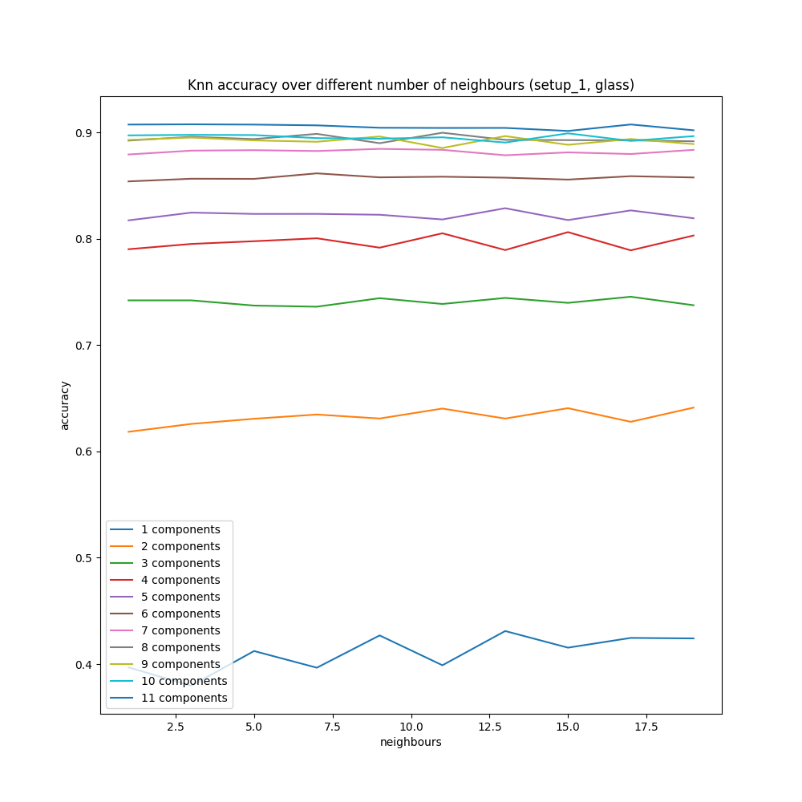
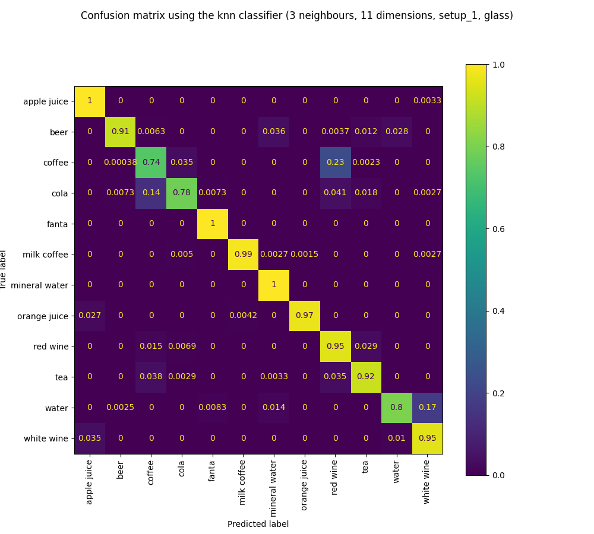
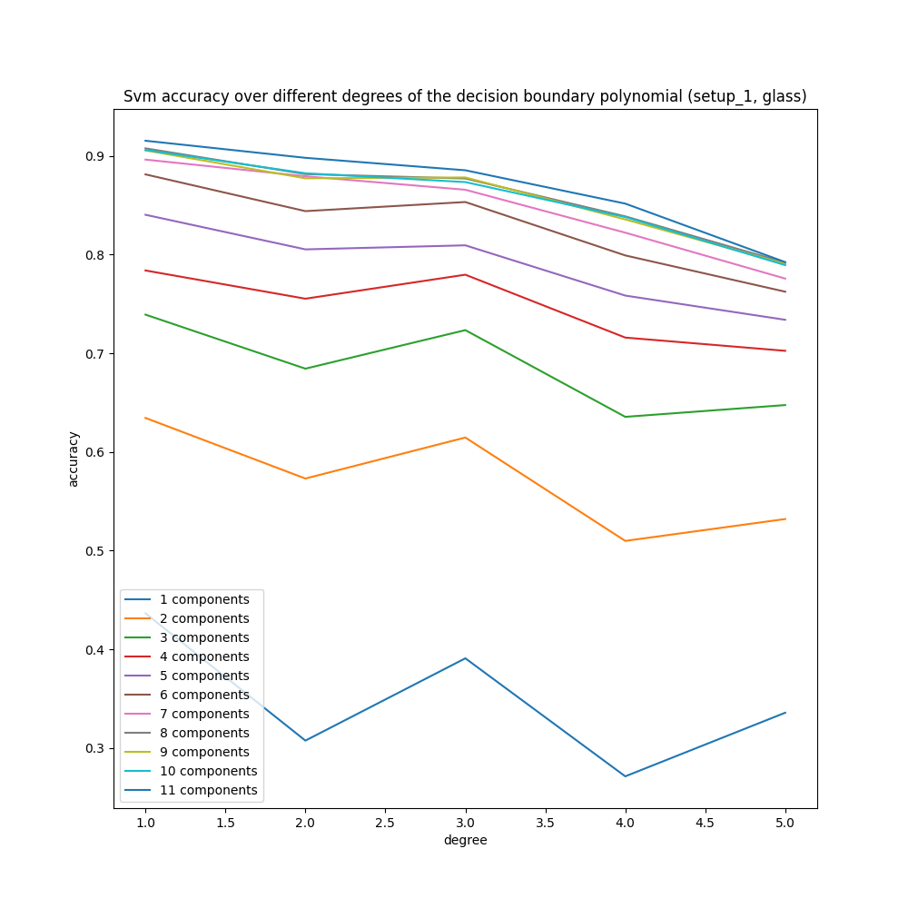
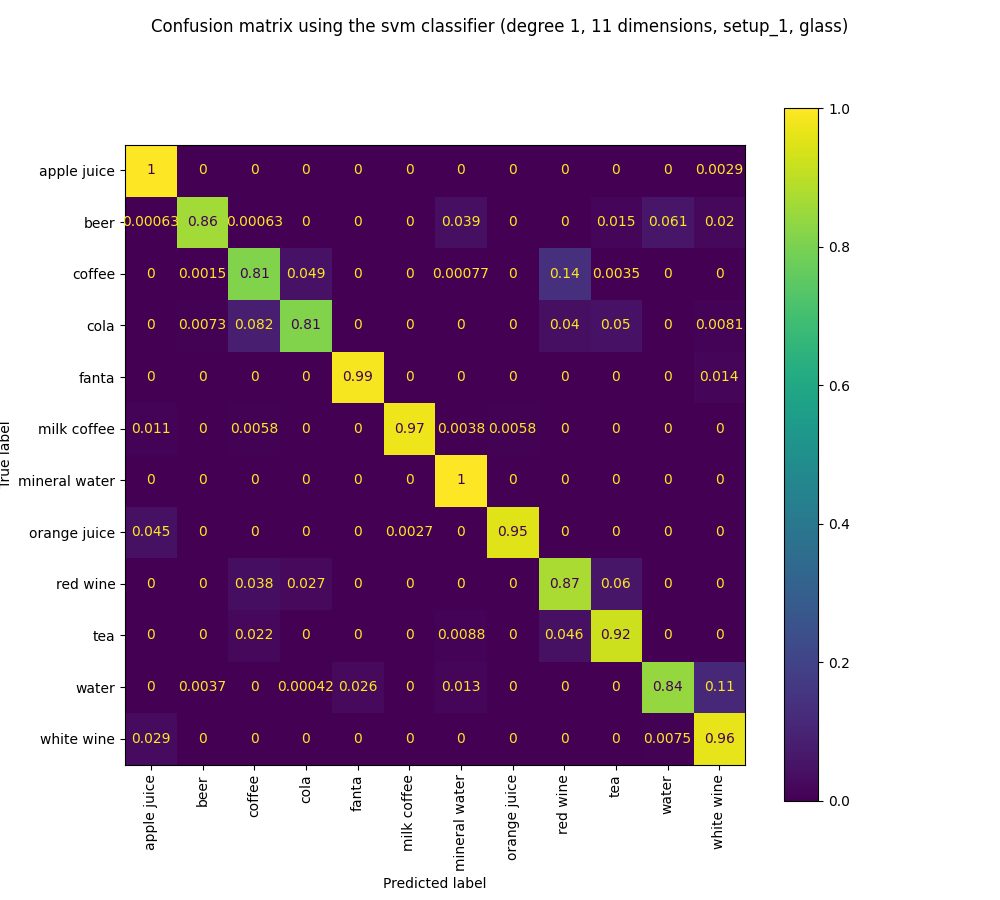
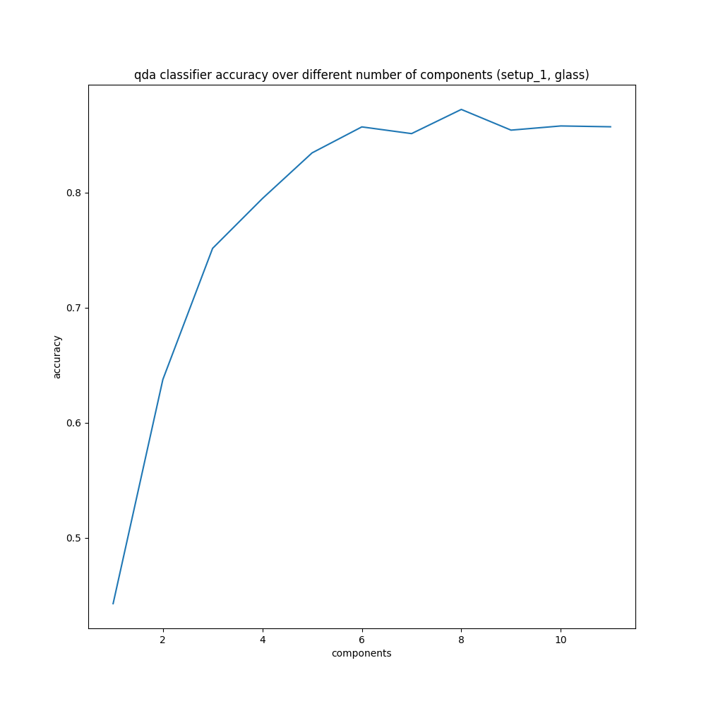
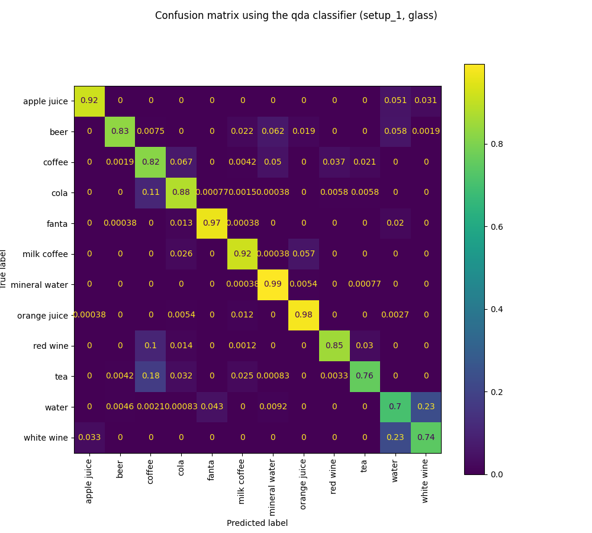

# Program usage and argument description
To analyze the different machine learning models on the collected data, there are different programs. All the programs
either create a plot of the behaviour of the classification accuracy of the model over varying model parameters or a
confusion matrix of one specific configuration. To run those programs, some arguments have to be specified in order to
achieve the desired results.

**Note:** After the repo reorganization, scripts are in `src/ml/`, processed CSVs in `data/processed/data_spec/`, and plots in `data/experiments/plots/`. Run commands from the repository root so relative paths resolve.

There are 6 different programs requiring different sets of arguments:
1. #### [knn_parameter_variation.py](../src/ml/knn_parameter_variation.py)
   - csv file path: the path to the csv file containing the data
   - setup name: name of the current setup, which is displayed in the plot titles
   - container name: if the model should only be trained on one specific container, this can be specified with this
   argument. If the model should be trained on the whole dataset, without considering one specific container, None can
   be passed.
   - dimensionality reduction method: Either pca or lda. Used for projecting the data into lower dimensional spaces.
   - dimension range: The range of dimensions the data should be projected on. Consists of three numbers: start, end,
   step (inclusive).
   - neighbour range: The range of neighbours the knn model should consider. Consists of three numbers: start, end, step
     (inclusive).

Calling this script might look like: `python3 smartcoaster/src/ml/knn_parameter_variation.py smartcoaster/data/processed/data_spec/test_data_setup1.csv setup_1 glass lda 1 11 1 1 20 2`
This would result in the following plot: 

2. #### [knn_classifier.py](../src/ml/knn_classifier.py)
   - csv file path: the path to the csv file containing the data
   - setup name: name of the current setup, which is displayed in the plot titles
   - container name: if the model should only be trained on one specific container, this can be specified with this
   argument (for our datasets, either glass, mug or wide glass). If the model should be trained on the whole dataset,
   without considering one specific container, None can be passed as argument.
   - dimensionality reduction method: Either pca or lda. Used for projecting the data into lower dimensional spaces.
   - dimensions: number of dimensions to project on
   - neighbours: number of neighbours considered by the knn model
   
Calling this script might look like: `python3 smartcoaster/src/ml/knn_classifier.py smartcoaster/data/processed/data_spec/test_data_setup1.csv setup_1 glass lda 11 3`
This would result in the following plot: 

3. [svm_parameter_variation.py](../src/ml/svm_parameter_variation.py)
   - csv file path: the path to the csv file containing the data
   - setup name: name of the current setup, which is displayed in the plot titles
   - container name: if the model should only be trained on one specific container, this can be specified with this
   argument. If the model should be trained on the whole dataset, without considering one specific container, None can
   be passed.
   - dimensionality reduction method: Either pca or lda. Used for projecting the data into lower dimensional spaces.
   - dimension range: The range of dimensions the data should be projected on. Consists of three numbers: start, end,
   step (inclusive).
   - degree range: The range of degrees for the decision boundary polynomial. Consists of three numbers: start, end, step
     (inclusive).
Calling this script might look like: `python3 smartcoaster/src/ml/svm_parameter_variation.py smartcoaster/data/processed/data_spec/test_data_setup1.csv setup_1 glass lda 1 11 1 1 5 1`
This would result in the following plot: 
   
   

   
4. [svm_classifier.py](../src/ml/svm_classifier.py)
   - csv file path: the path to the csv file containing the data
   - setup name: name of the current setup, which is displayed in the plot titles
   - container name: if the model should only be trained on one specific container, this can be specified with this
   argument (for our datasets, either glass, mug or wide glass). If the model should be trained on the whole dataset,
   without considering one specific container, None can be passed as argument.
   - dimensionality reduction method: Either pca or lda. Used for projecting the data into lower dimensional spaces.
   - dimensions: number of dimensions to project on
   - degree: degree of the decision boundary polynomial
Calling this script might look like: `python3 smartcoaster/src/ml/svm_classifier.py smartcoaster/data/processed/data_spec/test_data_setup1.csv setup_1 glass lda 11 1`
This would result in the following plot: 
   
   

   
5. [da_dimensions.py](../src/ml/da_dimensions.py)
   - csv file path: the path to the csv file containing the data
   - setup name: name of the current setup, which is displayed in the plot titles
   - container name: if the model should only be trained on one specific container, this can be specified with this
   argument. If the model should be trained on the whole dataset, without considering one specific container, None can
   be passed.
   - dimensionality reduction method: Either pca or lda. Used for projecting the data into lower dimensional spaces.
   - dimension range: The range of dimensions the data should be projected on. Consists of three numbers: start, end,
   step (inclusive).
   - classifier: The used classifier, either lda or qda
Calling this script might look like: `python3 smartcoaster/src/ml/da_dimensions.py smartcoaster/data/processed/data_spec/test_data_setup1.csv setup_1 glass lda 1 11 1 qda`
This would result in the following plot: 
   
   

   
6. [da_classifier.py](../src/ml/da_classifier.py)
   - csv file path: the path to the csv file containing the data
   - setup name: name of the current setup, which is displayed in the plot titles
   - container name: if the model should only be trained on one specific container, this can be specified with this
   argument (for our datasets, either glass, mug or wide glass). If the model should be trained on the whole dataset,
   without considering one specific container, None can be passed as argument.
   - dimensionality reduction method: Either pca or lda. Used for projecting the data into lower dimensional spaces.
   - dimensions: number of dimensions to project on
   - classifier: The used classifier, either lda or qda
Calling this script might look like: `python3 smartcoaster/src/ml/da_classifier.py smartcoaster/data/processed/data_spec/test_data_setup1.csv setup_1 glass lda 7 qda`
This would result in the following plot:
   
   
